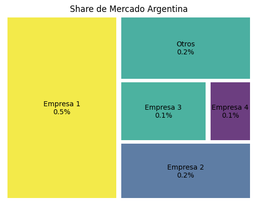
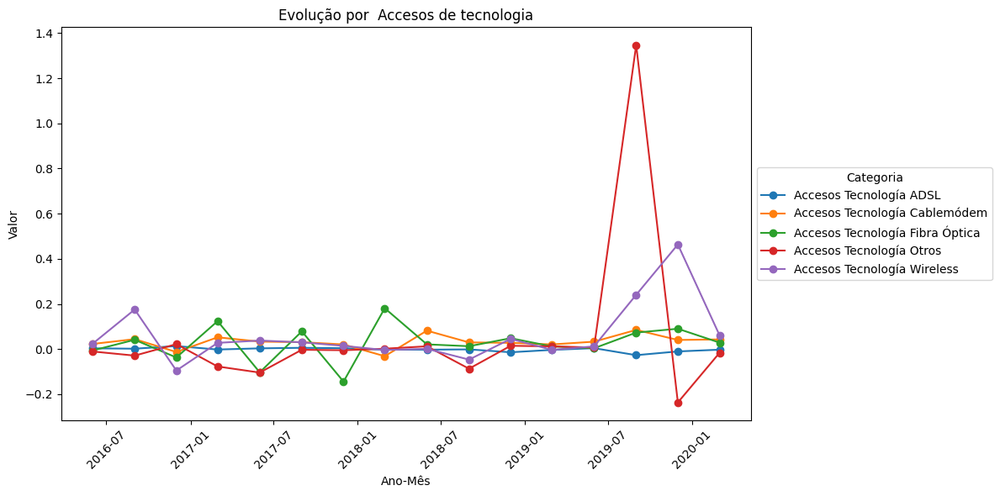
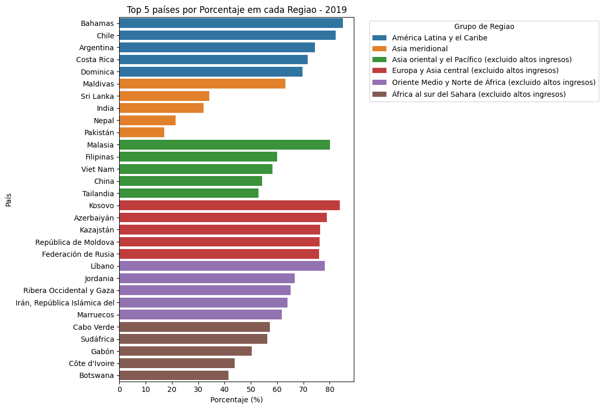
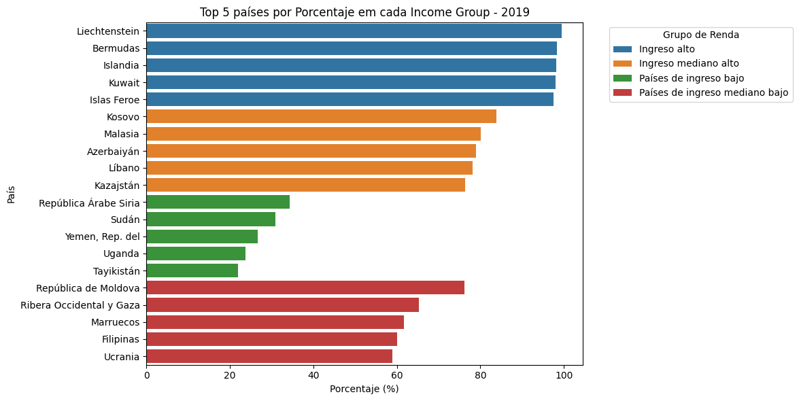
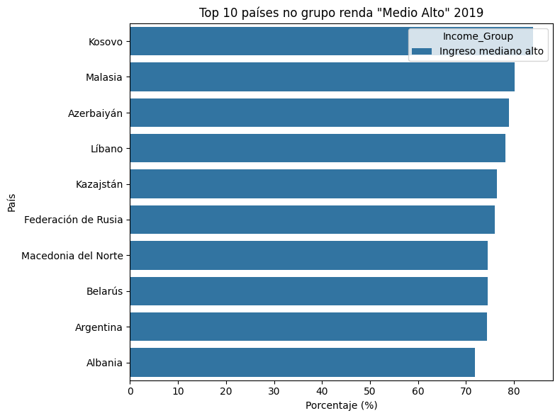
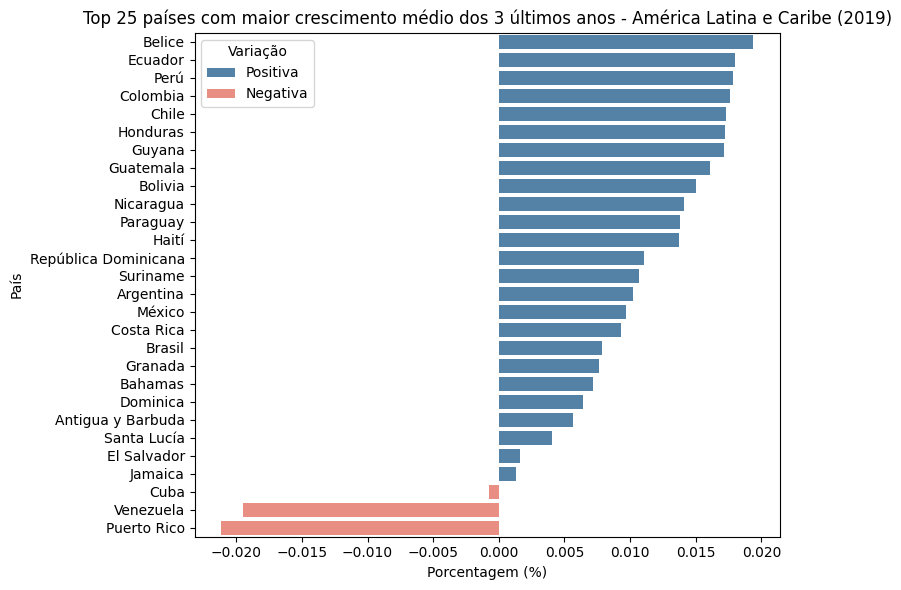

<h1 align="center"> 
CHALLENGE MERCADOLIBRE   "DIGITAL LINE SA"
</h1>

## Índice

1. [Contextualização](#contextualização)
2. [Objetivo da Análise](#objetivo-da-análise)
3. [Entendimento de Tabelas](#entendimento-de-tabelas)
4. [Perspectiva do Mercado Argentino](#perspectiva-do-mercado-argentino)
5. [Perspectiva do Mercado Global](#perspectiva-do-mercado-global)
6. [Recomendações Finais](#recomendações-finais)

## Contextualização

A **DIGITAL LINE SA** é uma multinacional com operações em todos os continentes, tendo o setor de telecomunicações como seu principal negócio. A empresa possui um perfil arrojado e histórico de adaptação a mudanças de mercado.

Recentemente, a empresa obteve bons resultados e acumula liquidez em dólar, o que abre oportunidades de investimento. O conselho de administração está analisando a possibilidade de entrar no setor de internet na **Argentina**, um país que, embora enfrente dificuldades econômicas, oferece ativos com preços atrativos.

A decisão precisa ser tomada com agilidade. O presidente do conselho, Mike Keller, necessita de um **dashboard analítico** com os principais indicadores que permitam avaliar rapidamente os riscos e oportunidades desse mercado.

O desafio consiste em estruturar esse painel com base nos dados fornecidos e complementá-los, se necessário, para embasar a decisão da diretoria.

## Objetivo da Análise

O objetivo desta análise é construir um **dashboard estratégico** com base nos dados fornecidos, que permita responder à seguinte pergunta:

**“Vale a pena investir no setor de internet na Argentina neste momento?”**

Para isso, serão exploradas:
- Tendências históricas do mercado argentino (faturamento, acessos, penetração etc.);
- Indicadores de crescimento, competitividade e maturidade do setor;
- Comparativos globais e regionais (ex: América Latina, países de renda semelhante);
- Classificações por velocidade, tecnologia e banda de acesso.

A análise servirá como base para a tomada de decisão pelo conselho da DIGITAL LINE SA.

## Entendimento de Tabelas

### Grupo de tabelas com foco no mercado argentino

- **Facturación Mercado Argentino:** Faturamento do mercado argentino ao longo do tempo;
- **Share de mercado Argentina:** Participação de mercado das principais empresas do país;
- **Acceso a internet en Argentina:** Percentual da população com acesso à internet.

### Grupo de tabelas com foco na Macroeconomia

- **Mercados Navegando:** Investimentos realizados pela empresa em sua entrada em diferentes países;
- **Población mundial:** Dados históricos da população global;
- **Usuarios de internet global:** Percentual de usuários de internet por país;
- **IDE:** Investimento Direto Estrangeiro por país;
- **GDP:** Produto Interno Bruto por país;
- **Defaults:** Dados de inadimplência por país;
- **Riesgo país:** Índice de risco-país;
- **Tipo de cambio USD:** Cotação histórica do dólar;
- **Países:** Lista de países e suas classificações.

## Perspectiva do Mercado Argentino

- **O mercado é dominado por 4 grandes empresas**, sendo que uma delas detém **50% de participação**. **As demais dividem 40%**, configurando um ambiente competitivo concentrado.

- **Crescimento consistente de faturamento trimestral**, com **aceleração significativa nos últimos dois anos**.

- **Faturamento e velocidade média de download são os indicadores com maior aceleração** — demonstrando potencial de crescimento.
- **Penetração e acesso à internet permanecem estáveis e correlacionados**, com **baixa variação negativa**.

- **Velocidades entre 20–30 Mbps são voláteis**, mas com altos picos de crescimento.
- **A velocidade acima de 30 Mbps cresce fortemente**, representando um **segmento estratégico para entrada**.
- **Acessos até 512 Kbps estão em queda acentuada** — tendência a ser monitorada.

- **Tecnologias Wireless e "Outros" mostram crescimento expressivo** — sugerem novas preferências de consumo ou mudanças estruturais.

- **Banda larga é muito mais estável** e mantém crescimento contínuo.
- **Banda estreita apresenta oscilações fortes e sinais de retração**.

## Perspectiva do Mercado Global

- **Países de renda média alta respondem melhor aos investimentos realizados**, com boa relação entre aporte e market share.

- **Europa e Ásia Central lideram em penetração de internet.**
- **América Latina e Caribe apresentam penetração próxima de 50%**, sendo **relevante para estratégias regionais**.

- **Argentina está na 3ª posição em penetração dentro da região**, reforçando o seu **potencial de mercado**.

- **Argentina não aparece entre os 5 principais países de renda média alta**, o que **indica potencial ainda não realizado**.

- **Argentina está na 9ª posição no grupo "Renda Média Alta"**, o que ainda **indica espaço para crescimento**.

### Velocidade de crescimento de usuários (média dos últimos 3 anos)

- **Oriente Médio e África Subsaariana lideram em crescimento**.
- **América Latina está entre as regiões com menor crescimento recente.**

- **Argentina mantém crescimento constante**, embora países do Caribe e o Chile liderem.

- **Argentina aparece na 22ª posição**, indicando **crescimento estável porém inferior ao de seus vizinhos regionais**.

- **Iraque, Namíbia e Cuba lideram entre os países de renda média alta**. Argentina **não aparece no top 5**, indicando desempenho mediano.

- **Argentina não está entre os 20 países com maior aceleração no grupo**, o que aponta para um **ritmo de crescimento linear**.

### Crescimento populacional

- **Argentina apresenta crescimento populacional positivo**, em contraste com **Venezuela e Porto Rico**.
- **Está na 15ª posição no ranking da região**, o que é **favorável ao potencial de expansão de mercado**.

### Risco País

- **Argentina é o 2º país com maior risco na América Latina e Caribe**.
- Apesar disso, o cenário de **desvalorização dos ativos** pode representar **uma oportunidade de entrada com alto potencial de retorno no médio/longo prazo**.

## Recomendações Finais

A partir da análise realizada, é possível concluir que:

- A **Argentina demonstra potencial para expansão no setor de internet**, principalmente devido ao crescimento em **velocidade média de conexão**, **faturamento** e **infraestrutura de alta velocidade**.
- **O mercado é concentrado**, com poucas empresas dominando o setor — isso representa **tanto uma barreira de entrada quanto uma oportunidade de diferenciação competitiva**.
- **A banda larga e as tecnologias wireless apresentam crescimento**, reforçando a viabilidade de ofertas modernas e premium.
- Embora a **Argentina não esteja entre os países de maior aceleração**, seu **ritmo de crescimento constante**, somado a um **cenário populacional favorável**, **suporta uma estratégia de investimento gradual e segmentada**.
- **O risco-país elevado exige cautela**, mas **também pode significar vantagem competitiva** para investidores dispostos a aceitar volatilidade em troca de **potencial de valorização futura**.

### Recomendação

Recomenda-se a **entrada estratégica no mercado argentino**, com foco em:

- **Produtos de alta velocidade e tecnologias emergentes (wireless, fibra)**;
- **Regiões urbanas com infraestrutura em crescimento**;
- **Monitoramento contínuo do risco-país** e flexibilidade para adaptação de estratégia conforme o cenário político e econômico;
- **Apostas progressivas**, priorizando nichos de maior potencial, com escalonamento conforme a resposta do mercado.

